

  <a href="https://termiprotocol.com">
    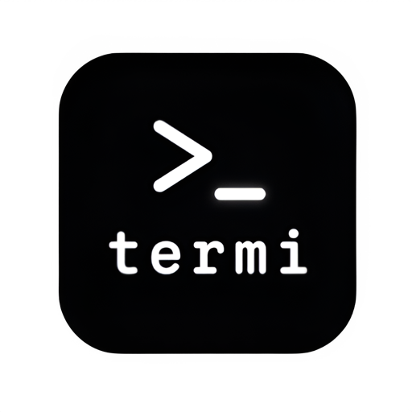
  </a>

  <h1>Termi Protocol</h1>

  

    <strong>Live 3D command center for AI coding agents, terminal workflows and gamified developer productivity.</strong>
  

  

    
    
    
  

  

    <a href="https://termiprotocol.com">Website</a>
    ·
    <a href="https://termiprotocol.com/download">Download</a>
    ·
    <a href="https://termiprotocol.com/roadmap">Roadmap</a>
    ·
    <a href="SECURITY.md">Security</a>
    ·
    <a href="https://github.com/search?q=termi+protocol+ai+agents&type=repositories">GitHub Discovery</a>
  

  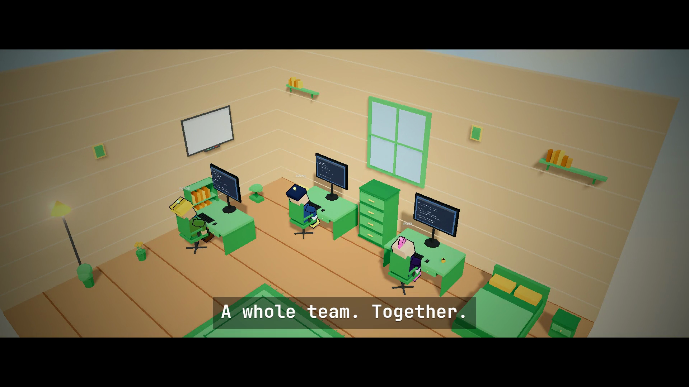

  <a href="https://ercaap.github.io/termi-protocol/" 
     style="font-size:13px; background:#111; padding:6px 14px; border-radius:999px; border:1px solid #27272a; color:#a3e635; text-decoration:none;">
    🌐 Live site: ercaap.github.io/termi-protocol →
  </a>

---

> This public repository is for product discovery, roadmap feedback, issue tracking and community visibility. It does not contain private application source code, internal prompts, customer data, secrets, build artifacts, API keys or deployment files. Marketing screenshots and short demo videos are included for visual reference only.

## The Idea

Termi Protocol is a desktop workspace for developers who run AI agents from the terminal. Create agents, assign tasks, watch their terminal sessions, and see file reads, edits, commands, approvals and progress come alive inside a Three.js room.

Your code stays on your machine. This repo stays public, simple and safe: product overview, links, issue templates and security guidance only.

<table>
  <tr>
    <td width="50%">
      <h3>Live Agent Room</h3>
      
Terminal events become visible in a real-time 3D workspace, so you can follow what every agent is doing without reading endless terminal scrollback.

      
Use it as an AI agent observability layer for commands, approvals, file activity and task progress.

    </td>
    <td width="50%">
      <h3>Task System For Agents</h3>
      
Assign work, track status, see blocked tasks, review completed steps and keep multiple agents aligned from one shared command center.

      
Built for coding agents that need clear task ownership, handoff notes and visible progress instead of hidden terminal state.

    </td>
  </tr>
  <tr>
    <td width="50%">
      <h3>Bring Your Own CLI</h3>
      
Use the terminal agents and model providers you already trust. Termi Protocol organizes the workflow around them.

      
Designed for Claude Code, Codex, Gemini CLI, Grok CLI, Aider, opencode, Ollama and other local or cloud-backed agent tools.

    </td>
    <td width="50%">
      <h3>Cozy Mini-Game Layer</h3>
      
XP, leagues, leaderboard progress, desk tools, room upgrades and small interactive systems make long agent sessions easier to monitor.

      
The game layer turns waiting, reviewing and supervising agent work into a more readable developer productivity loop.

    </td>
  </tr>
</table>

## In Action

  
<strong>Real workflows. Real time. Real presence.</strong>

<table>
  <tr>
    <td width="50%" align="center" valign="top">
      <video src="assets/demos/code.mp4" width="320" controls playsinline></video>
      
<strong>Code</strong> Agent writes, edits and runs in the workspace

    </td>
    <td width="50%" align="center" valign="top">
      <video src="assets/demos/team.mp4" width="320" controls playsinline></video>
      
<strong>Team</strong> Multiple agents collaborating live

    </td>
  </tr>
  <tr>
    <td width="50%" align="center" valign="top">
      <video src="assets/demos/control.mp4" width="320" controls playsinline></video>
      
<strong>Control</strong> Direct interaction and supervision

    </td>
    <td width="50%" align="center" valign="top">
      <video src="assets/demos/brain.mp4" width="320" controls playsinline></video>
      
<strong>Brain</strong> Agent memory, skills and thinking visible

    </td>
  </tr>
</table>

  
Full cinematic overview: <a href="https://termiprotocol.com">termiprotocol.com</a>

## Download

  
<strong>Same beautiful workspace on macOS and Windows.</strong>

<table>
  <tr>
    <td width="50%" align="center" valign="top">
      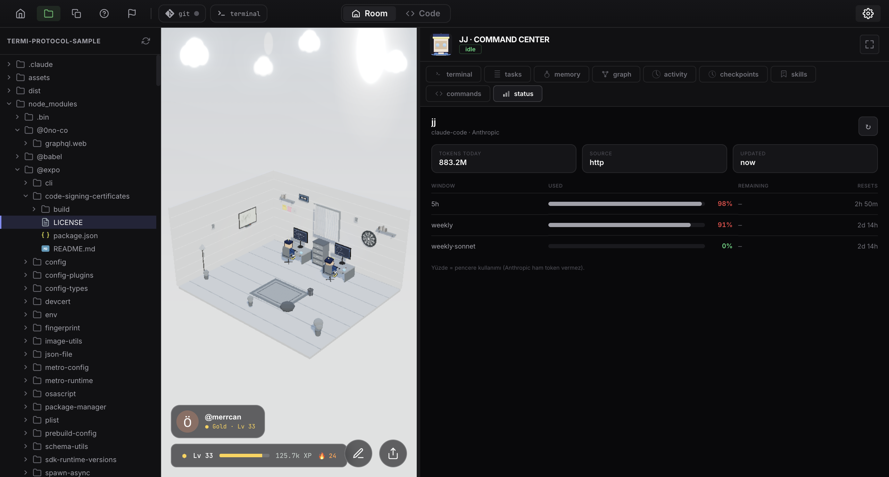
      <h3> macOS</h3>
      
Native desktop app with full 3D room + Command Center.

      
<a href="https://termiprotocol.com/download"><strong>Download for macOS</strong></a>

    </td>
    <td width="50%" align="center" valign="top">
      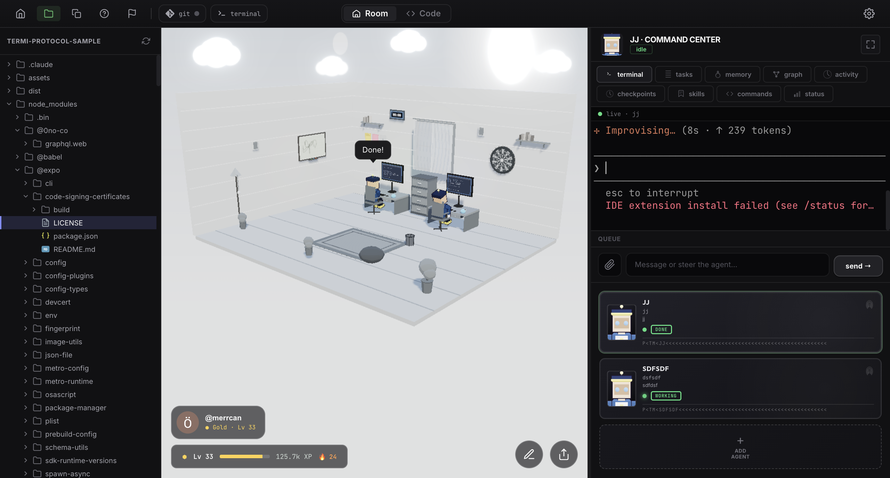
      <h3>🪟 Windows</h3>
      
Installer-focused workflow for AI agents and terminal control.

      
<a href="https://termiprotocol.com/download"><strong>Download for Windows</strong></a>

    </td>
  </tr>
</table>

  
<strong>Edit your room freely — no agents required.</strong>

  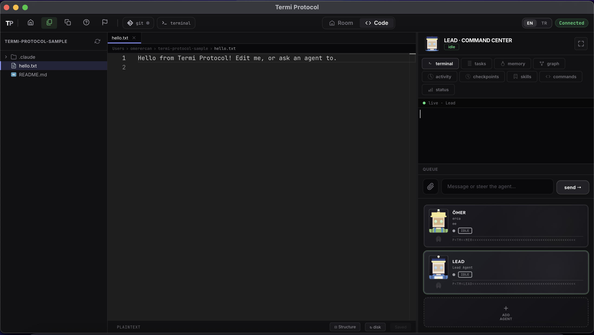
  
<em>Drag, place, customize furniture, posters and toys with your own hands.</em>

  <table>
    <tr>
      <td align="center">
        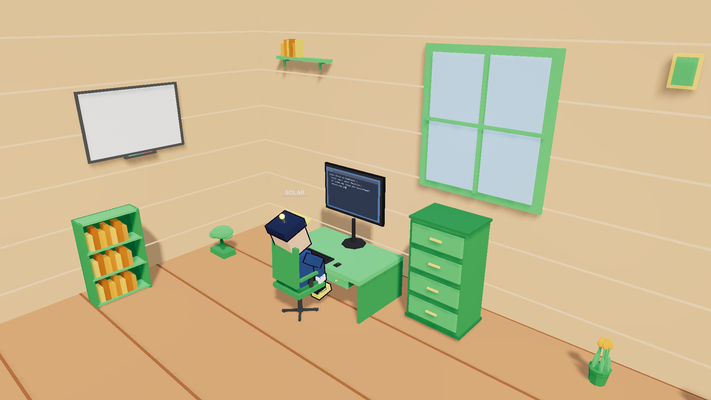
      </td>
      <td align="center">
        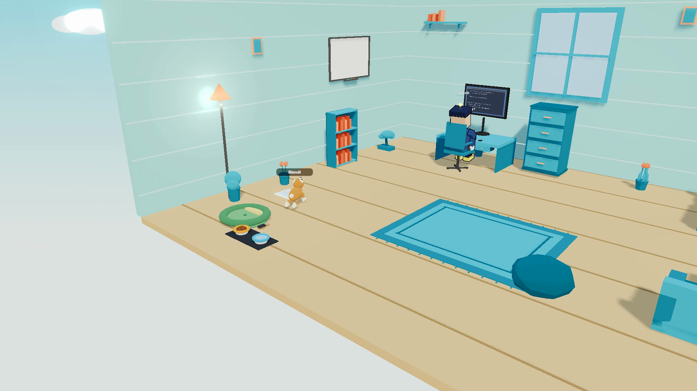
      </td>
    </tr>
  </table>

## What You Can Do

<table>
  <tr>
    <td width="50%">
      <h3>Create Terminal Agents</h3>
      
Create named AI coding agents and connect them to the CLIs you already use. Each agent can have a clear role, task and visible terminal session.

    </td>
    <td width="50%">
      <h3>Run Real Terminal Sessions</h3>
      
Keep terminal output, command review, approvals and task status in one place while agents work through local development tasks.

    </td>
  </tr>
  <tr>
    <td width="50%">
      <h3>Watch Live 3D Activity</h3>
      
See file reads, edits, command activity, checkpoints and state changes represented in a Three.js workspace for faster supervision.

    </td>
    <td width="50%">
      <h3>Coordinate Multiple Agents</h3>
      
Use task boards, shared memory, handoff notes and file-lock awareness to reduce collisions when more than one agent works on a project.

    </td>
  </tr>
  <tr>
    <td width="50%">
      <h3>Use Skills</h3>
      
Skills make repeatable workflows easier across coding, browser checks, documents, design tasks, project routines and team-specific processes.

    </td>
    <td width="50%">
      <h3>Recover With Checkpoints</h3>
      
Checkpoint history helps you review and recover when an agent edits the wrong file, runs a risky command or needs a controlled rewind.

    </td>
  </tr>
  <tr>
    <td width="50%">
      <h3>Track Cost And Tokens</h3>
      
Follow token and cost signals near the work itself, instead of switching between model dashboards, terminals and notes.

    </td>
    <td width="50%">
      <h3>Keep Work Local-First</h3>
      
Agents run through your own terminal environment, credentials and local tools, while this public repo remains source-free and safe.

    </td>
  </tr>
</table>

  <h3>Command Center</h3>
  
Tasks, terminal, memory, checkpoints and status — everything in one calm view.

  <table>
    <tr>
      <td align="center">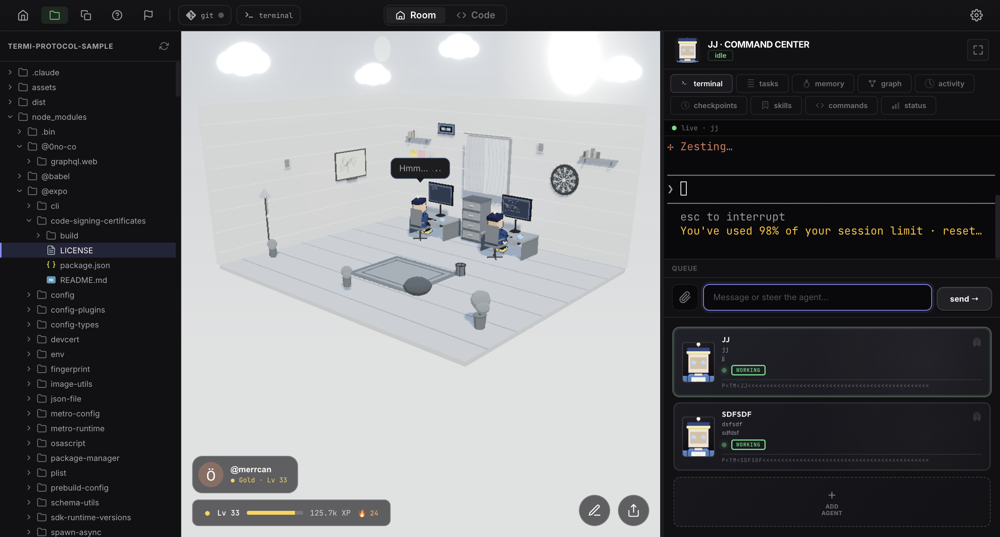</td>
      <td align="center">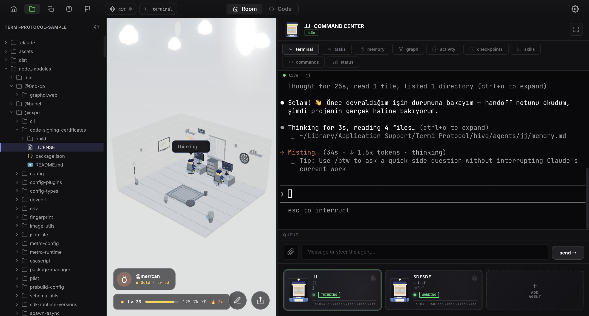</td>
      <td align="center">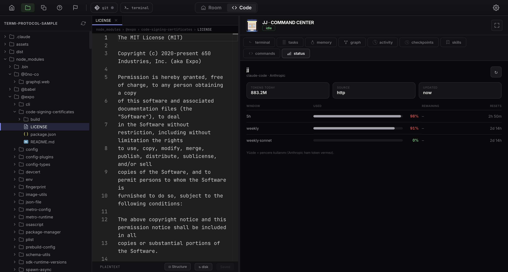</td>
    </tr>
  </table>

## Agent And CLI Ecosystem

Termi Protocol is designed for the AI coding tools developers search for and use every day:

| Agent / CLI | Workflow |
| --- | --- |
| Claude Code | AI coding agent sessions, task execution, code review loops and terminal supervision for local repositories |
| OpenAI Codex | local coding workflows, agent tasks, command review and multi-step software changes from the terminal |
| Gemini CLI | terminal-based AI development, research-heavy coding tasks and multi-agent experiments |
| Grok CLI | CLI agent workflows, coding automation and fast iteration from terminal prompts |
| GitHub Copilot CLI | developer assistant workflows, command suggestions and terminal-context productivity |
| Aider | repository-aware pair programming, code edits, refactors and conversational development sessions |
| opencode | open agent workflows, local development loops and terminal-first AI coding experiments |
| Ollama | local model workflows, private model testing and open-source LLM development loops |
| Groq | fast model-backed terminal workflows for low-latency agent experiments |
| Amazon Q Developer CLI | cloud development, infrastructure-adjacent workflows and developer assistant tasks |

## Systems We Use

This public repository never ships private source code, but the product language includes the systems users look for:

| Area | Public technology names | Public product role |
| --- | --- | --- |
| 3D interface | Three.js, GSAP | Real-time room, agent activity, motion and visual feedback for terminal events |
| Desktop app | Electron, Electron Builder, Electron Updater | Desktop distribution for macOS and Windows |
| Terminal UI | xterm.js | Embedded terminal experience for agent sessions and command review |
| Editor surface | Monaco Editor | Familiar code and text viewing surfaces for developer workflows |
| Backend and realtime | Supabase, Express, WebSocket, node-pty | Product-level auth, realtime state, terminal process orchestration and app communication |
| Language and tooling | TypeScript, Vite, Vitest, Playwright | Modern development stack, testing and browser-level verification |
| Platforms | macOS app settings, Windows installer assets | Platform-specific app setup and installation experience |

## Feature Details

### Agent Task Board

The task board is the planning layer for AI coding agents. It helps developers see which agent is doing what, which task is waiting for approval, which task is blocked, and which task is already done. This is useful for Claude Code, Codex, Gemini CLI and other terminal agents because the state of the work is no longer trapped inside a single terminal buffer.

### Terminal Agent Creation

Termi Protocol is built for creating and supervising terminal agents from a desktop app. A developer can start from a task, pick the agent workflow, launch the terminal session and keep the output connected to the same visible workspace.

### Skill System

Skills make agent behavior more repeatable. A coding workflow, document workflow, browser verification flow, design task or project-specific routine can be treated as a reusable process instead of a one-off prompt.

### Multi-Agent Collaboration

When several agents work at once, the hard part is coordination. Termi Protocol focuses on task ownership, handoffs, visible status and file-lock awareness so multiple coding agents can cooperate with less confusion.

### Live 3D Terminal Visualization

The 3D room is not just decoration. It is a live visual layer for terminal activity, agent state, file activity and command progress. Developers can keep an eye on long-running agent sessions without staring at raw logs the whole time.

### Mini-Games And Productivity Loops

The mini-game systems are designed for long agent sessions: XP, leagues, leaderboard progress, desk tools and room upgrades create a clearer sense of progress while agents work in the background.

## Why Developers Use It

Raw terminal agents can be hard to supervise: fast edits, hidden context, unclear state, long output and weak coordination between agents. Termi Protocol gives those agents a visible workspace and a task system, so developers can keep control while still moving fast.

Search-friendly topics this project is built around:

`AI coding agents` · `Claude Code workflow` · `OpenAI Codex` · `Gemini CLI` · `Grok CLI` · `terminal agent task management` · `multi-agent coding` · `Three.js developer tools` · `Supabase backend` · `Electron desktop app` · `macOS AI coding app` · `Windows AI coding app` · `cozy productivity game`

## Roadmap

Termi Protocol ships in chapters called protocols. Milano is live today, with future protocols expanding the 3D world, task system and workflow layer.

<table>
  <tr>
    <th>Chapter</th>
    <th>Protocol</th>
    <th>Status</th>
  </tr>
  <tr><td>01</td><td>Milano</td><td>Live</td></tr>
  <tr><td>02</td><td>Istanbul</td><td>Roadmap</td></tr>
  <tr><td>03</td><td>London</td><td>Roadmap</td></tr>
  <tr><td>04</td><td>Madrid</td><td>Roadmap</td></tr>
  <tr><td>05</td><td>Paris</td><td>Roadmap</td></tr>
  <tr><td>06</td><td>Mexico City</td><td>Roadmap</td></tr>
  <tr><td>07</td><td>Madrid</td><td>Roadmap</td></tr>
  <tr><td>08</td><td>Moscow</td><td>Roadmap</td></tr>
  <tr><td>09</td><td>Giza Pyramid</td><td>Roadmap</td></tr>
</table>

Full roadmap: **https://termiprotocol.com/roadmap**

  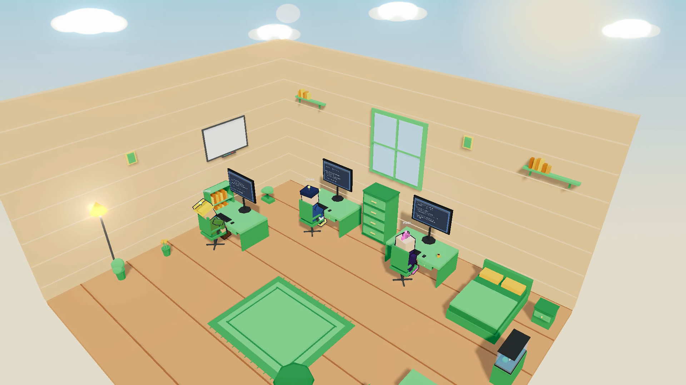

## Resources

| Link | Purpose |
| --- | --- |
| https://termiprotocol.com | Product website |
| https://termiprotocol.com/download | macOS and Windows downloads |
| https://termiprotocol.com/roadmap | Protocol roadmap |
| [SECURITY.md](SECURITY.md) | Security reporting policy |

## Public Issues

Please use GitHub Issues for public bug reports, feature requests, roadmap feedback and platform-specific installation questions.

Good public issues:

- macOS and Windows installation problems
- agent CLI compatibility requests
- feature ideas for the task board, terminal view, 3D room or mini-game systems
- roadmap feedback
- screenshots with private data removed

Do not post secrets, private source code, license keys, API keys, tokens, customer data, crash dumps with credentials, internal prompts or security vulnerabilities in public issues.

## Security

Please do not report security vulnerabilities through public issues. See [SECURITY.md](SECURITY.md).
